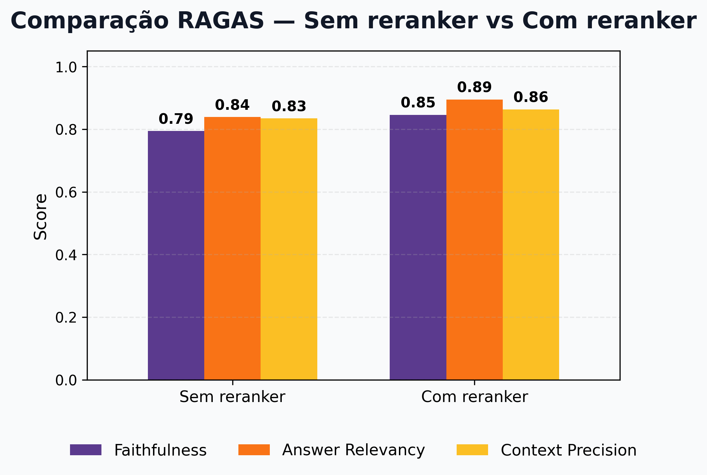

<!-- HEADER CENTRALIZADO -->
<h1 align="center">⚡ RAG para Domínio Elétrico</h1>

<p align="center">
  Sistema de Retrieval-Augmented Generation com foco em alta qualidade, avaliação robusta e transparência.
</p>

<p align="center">
  
  
  
  
  
</p>

## 📑 Índice

- [🏗️ Estrutura do Projeto](#%EF%B8%8F-estrutura-do-projeto)
- [⚙️ Stack](#%EF%B8%8F-stack)
- [🧠 Arquitetura](#-arquitetura)
- [🚀 Diferenciais](#-diferenciais-do-projeto)
- [📊 Resultados](#-resultados)
- [📁 Organização](#-organização)
- [⚡ Como Executar](#-como-executar)


## 🏗️ Estrutura do Projeto

<p align="center">
  
</p>


## ⚙️ Stack

<div align="center">

| Camada        | Tecnologia                                    |
| ------------- | --------------------------------------------- |
| **LLM**       | GPT-4o-mini                                   |
| **Embedding** | text-embedding-3-small / multilingual-e5-base |
| **Vector DB** | Qdrant                                        |
| **Framework** | LangChain                                     |
| **UI**        | Streamlit                                     |
| **Infra**     | Docker                                        |

</div>


## 🧠 Arquitetura

```text
Qdrant → vetores (embeddings + busca semântica)
````

### Decisão Arquitetural

|                    | Antes               | Agora       |
| ------------------ | ------------------- | ----------- |
| **Vector DB**      | Supabase + pgvector | Qdrant      |
| **Índice**         | Instável            | HNSW nativo |
| **Escalabilidade** | Limitada            | Alta        |


### Pipeline de Ingestão

<p align="center">
  
</p>


### Pipeline de Retrieval

<p align="center">
  
</p>


## 🚀 Diferenciais do Projeto

### Retrieval Avançado

* Ensemble Retriever (**semântico + BM25**)
* Chunking semântico com overlap
* Expansão de termos do domínio elétrico
* Reranking com cross-encoder
* Diversidade via MMR

```text
Fluxo:
Query → Expansão → Hybrid Retrieval → Reranker → MMR → Resposta
```


### Scores Transparentes

```text
semantic_score  → similaridade (cosine)
bm25_score      → relevância por termos
rerank_score    → cross-encoder
final_score     → fusão (RRF + reranker)
```


### Avaliação com RAGAS

* ✔ Faithfulness
* ✔ Answer Relevancy
* ✔ Context Precision


## 📊 Resultados

### Comparação RAGAS

| Métrica               | Sem reranker | Com reranker | Δ        |
| --------------------- | ------------ | ------------ | -------- |
| **Faithfulness**      | 0.79         | **0.85**     | ⬆️ +0.06 |
| **Answer Relevancy**  | 0.84         | **0.89**     | ⬆️ +0.05 |
| **Context Precision** | 0.83         | **0.86**     | ⬆️ +0.03 |


### 📈 Visualização

<p align="center">
  
</p>


### 🧠 Interpretação

* ✔ Menos alucinação (↑ Faithfulness)
* ✔ Melhor alinhamento com a pergunta
* ✔ Melhor seleção de contexto
* ✔ Ganho consistente em todas métricas

👉 **Reranker melhora qualidade sem trade-offs**


## 📁 Organização

```bash
/
├── docker-compose.yml
├── Dockerfile
├── requirements.txt
├── pyproject.toml
├── README.md
├── .env / .env.example
│
├── base/                    # dados ANEEL
│
├── docs/
│   └── Evaluation/
│       └── Graficos/
│           └── comparacao_ragas_reranker.png
│
├── eval/
│   ├── questions.json
│   └── results/
│       └── *.csv
│
├── assets/                 # diagramas
│
├── src/
│   ├── agent/
│   ├── answering/
│   ├── core/
│   ├── ingestion/
│   │   ├── parser.py
│   │   ├── chunker.py
│   │   └── embedder.py
│   │
│   ├── retrieval/
│   │   ├── hybrid.py
│   │   ├── reranker.py
│   │   ├── query_expansion.py
│   │   └── confidence.py
│   │
│   ├── scripts/
│   │   ├── ingest_data.py
│   │   ├── run_eval.py
│   │   └── plot_results.py
│   │
│   └── ui/
│       └── app.py
```


## ⚡ Como Executar

### 1. Configurar ambiente

```bash
cp .env.example .env
```

Preencha sua chave:

```env
OPENAI_API_KEY=your_key_here
```


### 2. Subir containers

```bash
docker compose up -d --build
```


### 3. Rodar ingestão

```bash
docker exec -it rag-eletrico-app \
env PYTHONPATH=src \
python src/scripts/ingest_data.py --clear
```


### 4. Rodar avaliação

```bash
docker exec -it rag-eletrico-app \
env PYTHONPATH=src \
python src/scripts/run_eval.py
```


### 5. Gerar gráficos

```bash
docker exec -it rag-eletrico-app \
env PYTHONPATH=src \
python src/scripts/plot_results.py
```


### 6. Acessar aplicação

👉 [http://localhost:8501](http://localhost:8501)


## 🛠️ Troubleshooting

```bash
# logs
docker compose logs -f

# parar tudo
docker compose down

# reset completo
docker compose down -v
```


## 🧠 Lógica de Resposta do Sistema

| Situação          | Resultado             |
| ----------------- | --------------------- |
| docs bons         | resposta com contexto |
| docs fracos       | resposta + aviso      |
| docs inexistentes | fallback controlado   |
| pergunta factual  | resposta direta       |

