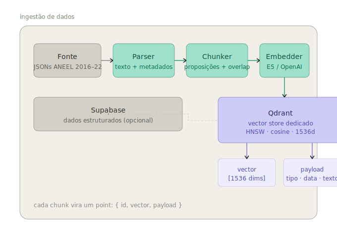
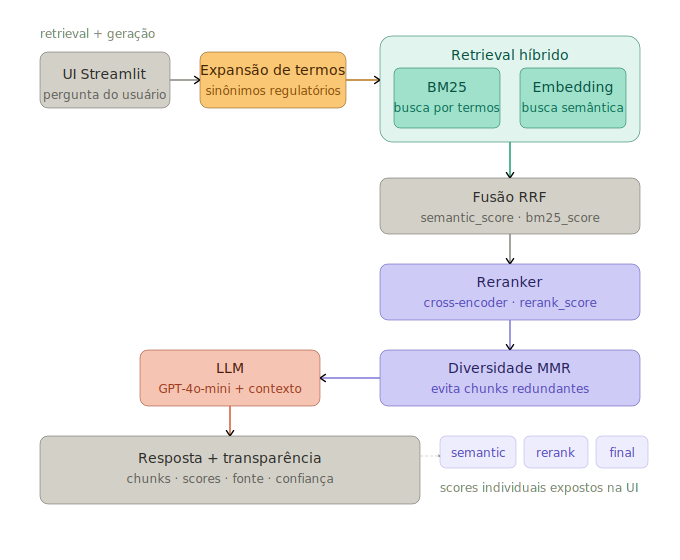

<!-- HEADER CENTRALIZADO -->
<h1 align="center">⚡ RAG para Domínio Elétrico</h1>

<p align="center">
  Sistema de Retrieval-Augmented Generation com foco em alta qualidade, avaliação robusta e transparência.
</p>

<p align="center">
  
  
  
  
  
</p>

## Estrutura do Projeto

<p align="center">
  
</p>

## Stack

<div align="center">

| Camada        | Tecnologia                                    |
| ------------- | --------------------------------------------- |
| **LLM**       | GPT-4o-mini                                   |
| **Embedding** | text-embedding-3-small / multilingual-e5-base |
| **Vector DB** | Qdrant                                        |
| **Framework** | LangChain                                     |
| **UI**        | Streamlit                                     |
| **Infra**     | Docker                                        |

</div>

---

## Arquitetura

A arquitetura separa responsabilidades entre banco vetorial dedicado e dados estruturados:

```text
Qdrant   → vetores (embeddings + busca semântica)
Supabase → dados estruturados (opcional)
```

### Decisão Arquitetural

| | Antes | Agora |
|---|---|---|
| **Vector DB** | Supabase + pgvector | Qdrant |
| **Índice** | HNSW com falhas | HNSW nativo e otimizado |
| **Observabilidade** | Limitada | Dashboard + inspeção de payloads |
| **Escalabilidade** | Inconsistente | Alta performance nativa |

---

### Pipeline de Ingestão


---

### Pipeline de Retrieval


## Diferenciais do Projeto

### Retrieval Avançado

- Ensemble Retriever (**semântico + BM25**)
- **Chunking semântico** por proposições com overlap controlado
- **Expansão de termos** do domínio regulatório elétrico
- **Reranking com cross-encoder**
- **Diversidade via MMR** (Maximal Marginal Relevance)

```text
Fluxo:
Query → Expansão de termos → Retrieval híbrido → Reranking + MMR → Resposta
```

### Scores Transparentes

Cada resultado expõe três scores independentes:

```text
semantic_score  → similaridade do embedding (cosine)
bm25_score      → relevância por termos (BM25)
rerank_score    → score do cross-encoder
final_score     → combinação ponderada (RRF + reranker)
```

### Avaliação com RAGAS

Métricas utilizadas:

- ✔ Faithfulness
- ✔ Answer Relevancy
- ✔ Context Precision

📈 Resultados quantitativos para apresentação técnica

### Transparência (UI)

Interface mostra:

- 📄 Chunks recuperados
- 📊 Score semântico, score do reranker e score final
- 🔗 Fonte do documento
- 🧠 Nível de confiança

---

## Organização

```bash
/
├── docker-compose.yml
├── Dockerfile
├── pyproject.toml          # dependências
├── README.md
├── .env
├── .gitignore
│
├── src/                    # CÓDIGO PRINCIPAL
│       ├── __init__.py
│       │
│       ├── ingestion/      # entrada de dados
│       │   ├── parser.py
│       │   ├── chunker.py  # chunking semântico por proposições
│       │   └── embedder.py # embeddings + expansão de termos
│       │
│       ├── retrieval/      # busca
│       │   ├── hybrid.py   # BM25 + embedding + fusão RRF
│       │   └── reranker.py # cross-encoder + diversidade MMR
│       │
│       ├── agent/          # LLM / LangChain
│       │   ├── chain.py
│       │   └── prompts.py
│       │
│       ├── eval/           # métricas (RAGAS)
│       │   └── benchmark.py
│       │
│       ├── ui/             # interface
│       │   └── app.py
│       │
│       ├── core/           # config / utilidades globais
│       │   ├── config.py
│       │   ├── settings.py
│       │   └── logging.py
│       │
│       └── infrastructure/ # integrações externas
│           ├── database.py
│           ├── vector_store.py  # Qdrant
│           └── llm_provider.py
│
├── tests/                  # testes
│   ├── test_ingestion.py
│   ├── test_retrieval.py
│   └── test_agent.py
│
├── scripts/                # scripts utilitários
│   ├── ingest_data.py
│   └── run_eval.py
│
├── docs/                   # documentação
│   └── arquitetura.md
│
├── base/                   # dados brutos ANEEL
│   ├── _MACOSX/
│   ├── biblioteca_aneel_gov_br_legislacao_2016_metadados.json
│   ├── biblioteca_aneel_gov_br_legislacao_2021_metadados.json
│   └── biblioteca_aneel_gov_br_legislacao_2022_metadados.json
│
└── assets/                 # imagens, diagramas
```

---

## Como Executar

(alterar depois de finalizado o projeto)

```bash
# Subir ambiente
docker-compose up --build

# Rodar aplicação
streamlit run ui/app.py
```
### RAG + fallback + transparência + decisão

| Situação          | Resultado          |
| ----------------- | ------------------ |
| docs bons         | RAG + explicação   |
| docs fracos       | explicação + aviso |
| docs inexistentes | aviso + fallback   |
| pergunta factual  | RAG puro           |


